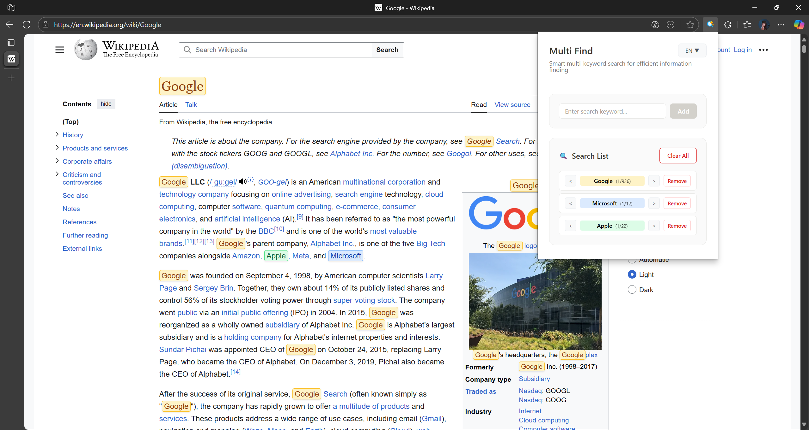

# Multi Find - Chrome多搜索插件
[English instructions](https://github.com/isyundong/Multi-Find/blob/main/README.md) | [中文说明](https://github.com/isyundong/Multi-Find/blob/main/README-CN.md)

一个强大的Chrome浏览器插件，解决原生Ctrl+F只能单个搜索的限制，支持在网页中同时搜索多个关键词并用不同颜色高亮显示。

## ✨ 功能特性

- 🔍 **多关键词搜索**: 同时搜索最多8个不同的关键词
- 🎨 **彩色高亮**: 每个搜索词使用不同颜色高亮显示
- ⚡ **实时搜索**: 即时显示搜索结果，无需刷新页面
- 🎯 **精确匹配**: 支持大小写敏感和全词匹配选项
- ⌨️ **快捷键支持**: Ctrl+Shift+F 快速打开搜索面板
- 🎪 **美观界面**: 现代化的用户界面设计
- 🌍 **多语言支持**: 英语、中文（简体和繁体）、法语、德语、俄语

## 🚀 安装方法

### 方法一：开发者模式安装（推荐）

1. 打开Chrome浏览器，进入扩展程序管理页面：
   - 地址栏输入 `chrome://extensions/`
   - 或者点击右上角三点菜单 → 更多工具 → 扩展程序

2. 开启「开发者模式」（页面右上角的开关）

3. 点击「加载已解压的扩展程序」

4. 选择本项目的文件夹

5. 插件安装完成！

### 方法二：打包安装

1. 在扩展程序页面点击「打包扩展程序」
2. 选择本项目文件夹，生成.crx文件
3. 将.crx文件拖拽到扩展程序页面完成安装

## 📖 使用指南

### 基本使用

1. **打开搜索面板**：
   - 点击浏览器工具栏中的Multi Find图标
   - 或使用快捷键 `Ctrl+Shift+F`

2. **添加搜索词**：
   - 在输入框中输入要搜索的关键词
   - 点击「添加」按钮或按回车键

3. **管理搜索词**：
   - 点击搜索词旁边的「移除」按钮删除单个搜索词
   - 点击「清空全部」按钮删除所有搜索词

4. **启用/禁用搜索**：
   - 点击「启用搜索」/「禁用搜索」按钮控制高亮显示

### 高级功能

- **颜色识别**: 每个搜索词会自动分配不同的高亮颜色
- **悬停效果**: 鼠标悬停在高亮文本上会有放大效果
- **智能匹配**: 自动处理特殊字符和正则表达式
- **导航功能**: 使用 ◀ 和 ▶ 按钮在每个关键词的匹配项之间导航
