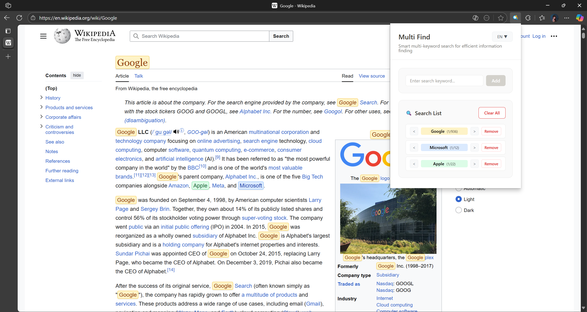

# Multi Find - Chrome Multi-Search Extension

[English instructions](https://github.com/isyundong/Multi-Find/blob/main/README.md) | [中文说明](https://github.com/isyundong/Multi-Find/blob/main/README-CN.md)

A powerful Chrome browser extension that solves the limitation of native Ctrl+F single search, supporting simultaneous search of multiple keywords on web pages with different color highlighting.

## ✨ Features

- 🔍 **Multi-keyword Search**: Search up to 8 different keywords simultaneously
- 🎨 **Color Highlighting**: Each search term uses different color highlighting
- ⚡ **Real-time Search**: Instant search results without page refresh
- 🎯 **Precise Matching**: Support for case-sensitive and whole word matching options
- ⌨️ **Keyboard Shortcuts**: Ctrl+Shift+F to quickly open search panel
- 🎪 **Beautiful Interface**: Modern user interface design
- 🌍 **Multi-language Support**: English, Chinese (Simplified & Traditional), French, German, Russian

## 🚀 Installation

### Method 1: Developer Mode Installation (Recommended)

1. Open Chrome browser and go to the extensions management page:
   - Enter `chrome://extensions/` in the address bar
   - Or click the three-dot menu in the top right → More tools → Extensions

2. Enable "Developer mode" (toggle in the top right corner)

3. Click "Load unpacked"

4. Select this project folder

5. Extension installed successfully!

### Method 2: Package Installation

1. Click "Pack extension" on the extensions page
2. Select this project folder to generate a .crx file
3. Drag the .crx file to the extensions page to complete installation

## 📖 User Guide

### Basic Usage

1. **Open Search Panel**:
   - Click the Multi Find icon in the browser toolbar
   - Or use the keyboard shortcut `Ctrl+Shift+F`

2. **Add Search Terms**:
   - Enter keywords to search in the input box
   - Click the "Add" button or press Enter

3. **Manage Search Terms**:
   - Click the "Remove" button next to search terms to delete individual terms
   - Click "Clear All" button to delete all search terms

4. **Enable/Disable Search**:
   - Click "Enable Search"/"Disable Search" button to control highlighting

### Advanced Features

- **Color Recognition**: Each search term is automatically assigned different highlight colors
- **Hover Effects**: Hovering over highlighted text shows magnification effects
- **Smart Matching**: Automatically handles special characters and regular expressions
- **Navigation**: Use ◀ and ▶ buttons to navigate between matches for each keyword
